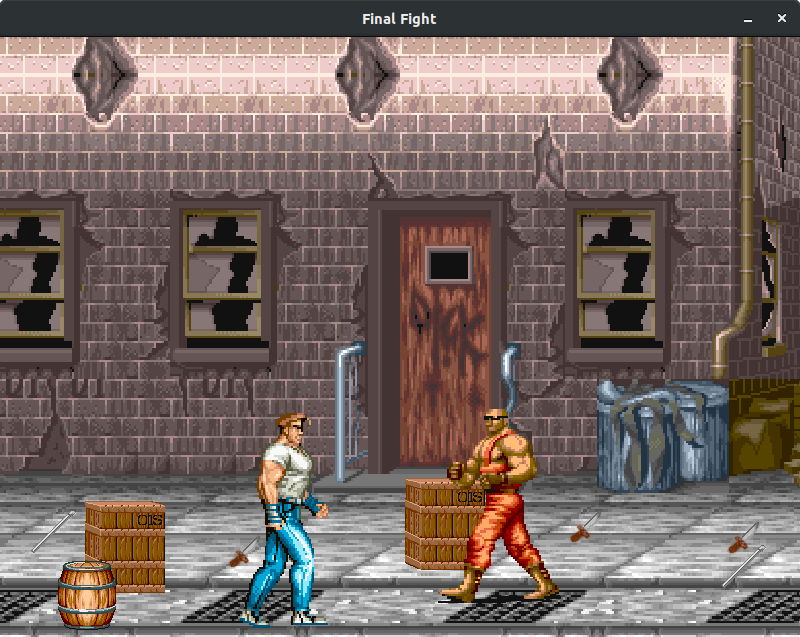
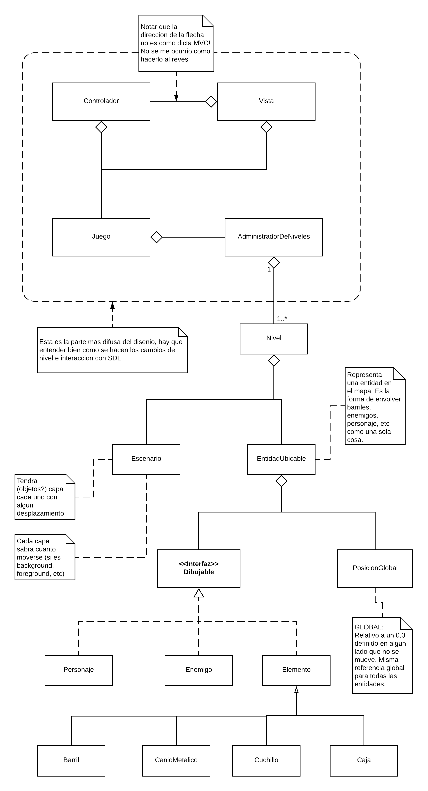

# Final Fight - Fase 1
### Grupo Eclipsados
Juego estilo ['Final Fight'](https://www.youtube.com/watch?v=KL22s0MPiA4).

Entrega: 25/9/2019

Este repositorio solo contiene lo respectivo a la primera fase del proyecto (primeros pasos y manejos basicos de SDL). Para los binarios de las fases 2 y 3 (incluyendo el resultado final), ver los repositorios [Eclipsados-Servidor](https://github.com/nachonitz/Eclipsados-Servidor) y [Eclipsados-Cliente](https://github.com/nachonitz/Eclipsados-Cliente).

Ver la seccion 'Releases' para mas informacion.

### UML Global

### Recursos
**Tutoriales**:
* http://lazyfoo.net/tutorials/SDL/
* https://www.willusher.io/pages/sdl2/

**Sonidos**:
* https://www.bfxr.net/

**Parallax**:
* https://gamedevelopment.tutsplus.com/tutorials/parallax-scrolling-a-simple-effective-way-to-add-depth-to-a-2d-game--cms-21510
